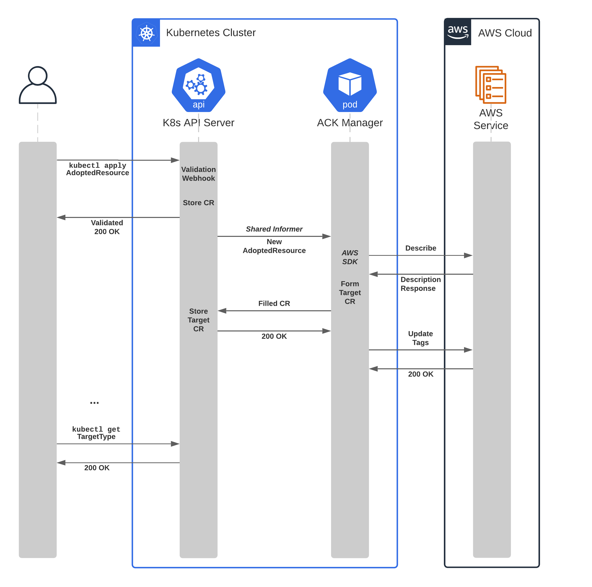

# Resource Adoption 

# The Problem

New ACK users typically already have implemented their infrastructure in existing solutions, meaning they have deployed production AWS resources into their accounts. While ACK provides good tooling for creating new resources, the path to migration from existing declarative infrastructure technologies into ACK is, so far, bumpy. The current method for migration requires users to store the current state of their applications, delete the resources, and re-create them using ACK. This process introduces numerous places for bugs, loss of the state of existing deployments and downtime in production workloads. Furthermore, considering the case where a K8s cluster loses state, users have no path to recover the previous resources without having to recreate all of them using ACK.

ACK aims to provide the ability to “adopt” existing resources into your Kubernetes environment. Given the user has access to an existing resource, and that ACK operators exist for each resource’s associated service, the ACK controller will be able to determine the current specification and status of the AWS resource and reconcile said resource as if it were created natively in k8s.

Users have requested this functionality as being pivotal to their adoption of ACK (see [#41](https://github.com/aws/aws-controllers-k8s/issues/41)). Information from user feedback has been considered as part of this document.

Below are a number of use cases for requesting the ability this feature.

1. Migrating existing architecture from another platform (CFN, CDK, Terraform, etc.)
    1. Resources exist but have never been managed by K8s - no spec files
2. Restoring from a broken K8s environment (etcd failure, complete state loss)
    1. Resources exist and have previously been managed by K8s, but are not being actively reconciled
3. Migrating architecture across K8s environments
    1. Resource exist and are actively being managed by another K8s environment

# Proposed Implementation

## Overview

The proposed solution will provide an alternate workflow by which to adopt resources through a separate set of manifests. A new custom resource definition, the `AdoptedResource` CRD, provides a standardised template by which to indicate to ACK that it should attempt to adopt a given resource. 
The `AdoptedResource` CRD provides a boilerplate to reference an existing AWS resource (either through ARN, name or other unique identifier) and a target ACK type. Each ACK manager will subscribe to the list of adopted resources and will attempt to adopt any resources that match its managed type.
The manager will describe the referenced AWS resource, typically through a `Describe*` SDK call, and use the returned values to compile a new custom resource - with filled spec and status fields. The manager will then apply this custom resource to the cluster using the metadata applied in the `AdoptedResource` spec.

## `AdoptedResource` Specification

The `AdoptedResource` custom resource definition will allow for specification of an AWS resource unique identifier, a target ACK type (with API group and kind), and target metadata fields.
The AWS resource unique identifier allows identification through at most one of:

* `arn` - An [ARN](https://docs.aws.amazon.com/general/latest/gr/aws-arns-and-namespaces.html) (Amazon Resource Name)
* `name` - A resource name (a string value)
* `id` - A resource ID (an integer value)

The custom resource definition makes no assumptions about which fields should be present for any given target kind. It is therefore up to the manager to validate the identifier input shape for existence and correctness.

The target ACK type is specified through the following required fields:

* [API group and version](https://kubernetes.io/docs/concepts/overview/kubernetes-api/#api-groups-and-versioning)
* [Resource kind](https://kubernetes.io/docs/reference/kubectl/overview/#resource-types)

A validating webhook for the `AdoptedResource` custom resources will validate the existence of the target type in the cluster and ensure the requested type is able to be adopted. 

The target metadata field is an arbitrary mapping of key-value pairs that will be applied as the metadata for the created custom resource. If a `name` field is specified in this mapping, the manager should use this value as the custom resource `name` . Otherwise, the manager will use the name specified in the metadata of the `AdoptedResource` as the default name for the resource. This same method will also apply to the `namespace` field. All other fields in the metadata mapping are applied to the created resource without validation.

### Example Specifications

**1. An adopted S3 bucket with the minimal number of fields**

```
apiVersion: s3.services.k8s.aws/v1alpha1
kind: AdoptedResource
metadata:
  name: adopted-data-bucket
spec:
   apiVersion: s3.services.k8s.aws/v1alpha1
   kind: Bucket
   identifier:
        arn: arn:aws:s3:::my-data-bucket
```

**2. An adopted S3 bucket with overriding metadata fields**

```
apiVersion: s3.services.k8s.aws/v1alpha1
kind: AdoptedResource
metadata:
  name: adopted-data-bucket
spec:
   apiVersion: s3.services.k8s.aws/v1alpha1
   kind: Bucket
   metadata:
        name: data-bucket
        namespace: team-a
        annotations:
            ...
   identifier:
        arn: arn:aws:s3:::my-data-bucket
```

**3. An adopted API Gateway v2 API (using an ID identifier)**

```
apiVersion: apigateway.services.k8s.aws/v1alpha1
kind: AdoptedResource
metadata:
  name: adopted-api-gateway
spec:
   apiVersion: apigateway.services.k8s.aws/v1alpha1
   kind: Api
   identifier:
        id: 123456789012
```

### Custom Resource Validation Webhook

In order to minimise the chance of user’s facing unexpected behaviours, a validating webhook will validate any adopted resource changes prior to submission to the ACK managers. The webhook will primarily reject the following error cases:

1. The provided target ACK type does not exist within the cluster
2. The target resource would override an existing resource
3. The target resource type cannot be adopted

## Adopted K8s Resource Tagging

All adopted resources will be annotated with an ACK-specific annotation that differentiates it from a natively created resource. This annotation serves to ensure clarity for users about possible specification differences introduced during the adoption process, or for filtering by adopted status. However, once adopted into a cluster, a resource will be reconciled with the same logic as any natively created resource. 

The proposed k8s adopted tag is `services.k8s.aws/adopted: true`

The adopted annotation would remain on the custom resource for the remainder of its lifecycle, and should not be modified by any other manager operation. 

## AWS Resource Tagging

AWS resources adopted by an ACK controller will have tags retroactively applied (whenever possible) to indicate its association with an ACK deployment. The details of these tags are discussed in another issue ([#148](https://github.com/aws/aws-controllers-k8s/issues/148)). ACK managers should not place any conditions on the existence of ACK tags on the AWS resources to gate the adoption process. The manager should should override any existing ACK tags.

## Resource Type Blocklisting

Adoption, for some resources, is not possible due to any number of the following reasons:

* They are ephemeral resources which don’t support additional lifecycle operations (one-time jobs)
* The service cannot provide adequate information to produce a full specification
* Unforeseen limitations within ACK or the service directly

For any of these cases, the resource can be marked as “not adoptable” and the validation webhook will subsequently reject any adopted resources of this type. Therefore, the manager will never attempt to run the adoption process. This flag can be set in the generator configuration file with the `cannot_adopt` boolean option supplied for any resource.

## Adoption Process Diagram


# Potential Alternatives

## Resource Adoption Annotation

The existing custom resource definitions (every service resource) would accept an additional annotation that the manager interprets as an indication that the resource specification should be ignored and instead that it should be formed through adoption. For any resource marked with this annotation, upon creation, the manager would attempt to describe the AWS resource associated with the annotated value. If none such resource exists, the manager would update the state of the custom resource into a `AdoptionFailed` terminal state. If the resource does exist, the manager would continue the follow the same adoption process as defined in the [Proposed Implementation](#proposed-implementation) section.

### Example Specification

**An example adopted S3 resource**

```
apiVersion: s3.services.k8s.aws/v1alpha1
kind: Bucket
metadata:
  annotations:
    services.k8s.aws/arn: arn:aws:s3:::my-existing-bucket
  ...
spec:
   ...
```

### Notable Pitfalls

In the event that the user is attempting to restore resources created in a previous installation of ACK (in the event of an etcd corruption, for example), each manifest will need to be updated with the adoption annotation. Therefore the restoration process would require modifying desired state files (k8s manifests) with actual state fields (the created ARN/ID fields). At the least this introduces a temporary change in k8s manifests - add ARNs to manifests,  apply and adopt, delete ARNs from manifests. More so, it could introduce private field information (generated public API IDs, RDS instance ARNs, etc.) into the manifests repository.

Another pitfall is that, given this solution aims to re-use the existing custom resource definitions, all adopted resources would need to provide a specification body that contains all required fields. Every service contains a distinct set of required values, and as such the user would need to modify every adopted resource type with a distinct set of valid dummy values. Assuming a user provides dummy values for these fields, they would subsequently be overwritten by the manager logic when updating the resource.

# In Scope

* Declaration of the new `AdoptedResource` CRD
* Updates to generator for service-specific configuration
* Code paths for service managers to receive informer updates
* Unit and E2E tests with a specific ACK controller (e.g. S3 buckets)
* Verbose logging for adoption lifecycle updates

# Out of Scope

* Integration of adopted resource types for every ACK controller
* E2E tests for every ACK controller
* Tooling for generating `AdoptedResource` CRs

# Test Plan

## Unit Tests

* Assert validation webhook detects and rejects all blocked conditions
* Assert manager receives shared informer events
* Assert manager can create target CR type from description
* Assert manager makes call to update AWS resource tags

## E2E Tests

Requirements:

* 1 Kubernetes cluster
* 1+ Existing AWS resources
* 1 ACK controller (e.g. S3)
    * Minimum 1 adoptable resource type
    * Minimum 1 non-adoptable resource type

Procedure:

* Create `AdoptedResource` of target type that does not exist
    * Assert validation webhook fails
* Create `AdoptedResource` of target type that does exist
    * Assert controller creates target type resource
    * Assert created resource specification matches expected fields
    * Assert AWS resource tags have been updated
    * Assert status of created resource is stable
* Create `AdoptedResource` that has the same metadata name as previous
    * Assert validation webhook fails
* Create `AdoptedResource` of type that explicitly blocks adoption
    * Assert validation webhook fails

# Discussions

> How are users able to bulk import existing resources?

For users that hope to bulk import existing resources, an automated way of creating `AdoptedResource` custom resources would expedite the initial effort. This automation is outside the scope of this implementation. However, given a user can create all of the resources, and installs all the necessary controllers, the method of adopting many resources fundamentally remains the same as importing them all singly.


> How can I migrate across an ACK installation using adopted resources to maintain application state?

The following workflow may apply to this transition:

1. Export the identifiers (ARNs/IDs) from the current installation resources’ states
2. Create `AdoptedResource` CRs for each of these identifiers
3. Install and configure all necessary controllers to the new cluster
4. Apply the `AdoptedResource` CRs to the cluster
    1. Wait for all resources to end up in terminal state
5. Delete the ACK controller deployments from the old installation
    1. Do NOT delete the custom resources, this will delete the underlying AWS resources
6. Apply existing manifests to override the newly created resources
    1. *Note: If their state is already as desired, this should not make any updates to the AWS resources*
7. Delete the custom resources from the old installation

